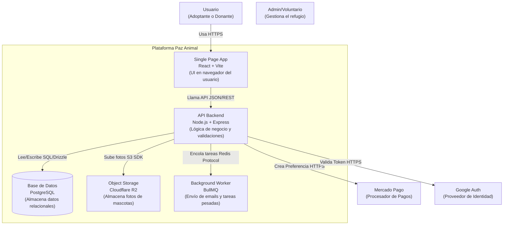
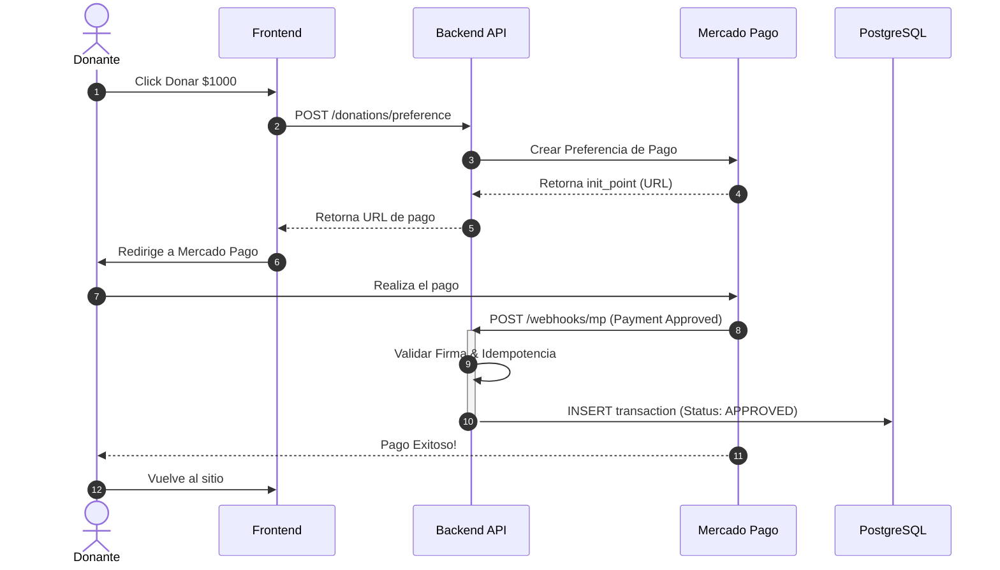

# System Design Document (ADD)

## 1. Análisis de Requisitos y Escala (Back-of-the-envelope)

Antes de diseñar, calculamos la carga esperada para asegurar una arquitectura eficiente ("no matar moscas a cañonazos") pero preparada para el crecimiento.

### 1.1 Métricas de Carga Estimadas (Fase 1)

- **DAU (Usuarios Activos Diarios):** ~1,000 usuarios (con picos durante campañas).
- **Ratio Lectura/Escritura:** 100:1 (Alto volumen de visualización, bajo volumen de edición/adopción).
- **QPS (Queries Per Second):**
- _Reads:_ ~10 QPS (Bajo, manejable por cualquier DB SQL moderna).
- _Writes:_ < 1 QPS.

> **Conclusión:** Un diseño **Monolítico** con una sola instancia de Base de Datos es suficiente. No se requiere _Sharding_ ni Microservicios en esta etapa.

### 1.2 Estimación de Almacenamiento

- **Base de Datos (Texto):** Registros de usuarios, mascotas y transacciones.
- _Crecimiento:_ ~1GB / año (PostgreSQL maneja TBs sin problemas).

- **Media (Imágenes/Docs):** El consumidor principal de espacio.
- _Estrategia:_ **Offloading**. Las imágenes **NO** van a la DB. Se almacenan en Cloudflare R2 (Object Storage).
- _Estimación:_ 500 mascotas x 5 fotos x 200KB = **~500MB de stock activo.**

---

## 2. Estrategia de Datos (Persistencia)

### 2.1 Selección de Base de Datos Principal

- **Decisión:** Relacional (SQL) - **PostgreSQL**.
- **Justificación:**
- **Integridad Referencial (ACID):** Vital para evitar inconsistencias financieras o de inventario (ej. una adopción debe bloquear la mascota para otros).
- **Relaciones Complejas:** El modelo requiere _Joins_ constantes (Mascota -> Raza -> Vacunas).
- **Ecosistema:** Soporte de primera clase con Drizzle ORM.

### 2.2 Estrategia de Escalado

- **Fase 1 (Actual):** Escalado Vertical. Aumento de recursos (RAM/CPU) en Railway si es necesario.
- **Fase 2 (Futuro):** _Read Replicas_. Si las lecturas saturan al nodo maestro, se implementará una réplica de solo lectura para el catálogo público.

---

## 3. Caché y Optimización de Latencia

Dado que el acceso a RAM es exponencialmente más rápido que a disco, implementamos una estrategia de caché en capas.

### 3.1 Niveles de Caché

1. **CDN (Cloudflare):** Cacheo agresivo de imágenes y assets estáticos (JS/CSS) en el borde (_Edge_).
2. **Browser Cache (HTTP):** Cabeceras `Cache-Control` en respuestas API públicas (ej. lista de razas) para evitar hits al servidor.
3. **Application Cache (Server State):** React Query en el Frontend actúa como caché de corta duración para mejorar la UX.

### 3.2 Estrategia (Backend)

- **Patrón:** _Cache-Aside_ (Lazy Loading).
- _Flujo:_ Pedir dato -> Check Caché -> Si es `null`, Query DB -> Escribir en Caché -> Retornar.

- **Tecnología:**
- _V1:_ Caché en memoria (LRU simple).
- _V2:_ Redis gestionado.

---

## 4. Comunicación y API

### 4.1 Estilo de Comunicación

- **Protocolo:** REST (JSON) sobre HTTP/1.1 (o HTTP/2).
- **Ventaja:** Estandarizado, fácil de probar y nativo para el ecosistema React.

### 4.2 Procesamiento Asíncrono

Para tareas que no deben bloquear la experiencia del usuario (ej. emails de confirmación).

- **Mecanismo:** _Message Queue_ simple.
- **Implementación V1:** **BullMQ** (basado en Redis), procesando trabajos en _background_ dentro del mismo servicio (Monolito Modular).

---

## 5. Resiliencia y Seguridad

### 5.1 Rate Limiting

Protección contra fuerza bruta y ataques DDoS de capa 7.

- **Herramienta:** `express-rate-limit`.
- **Política:**
- _Público:_ 100 requests / 15 min por IP.
- _Auth (Login):_ 5 intentos fallidos / hora.

### 5.2 Idempotencia

Crítico para el módulo de pagos (Mercado Pago).

- **Regla:** Si el webhook de "Pago Aprobado" llega múltiples veces, el sistema debe procesarlo **solo una vez**.
- **Mecanismo:** Verificación mediante `payment_id` único en la tabla de transacciones.

---

## 6. Diagramas de Arquitectura (Mermaid)

### 6.1 Diagrama de Contenedores (C4)

### 6.2 Diagrama de Secuencia: Flujo de Donación

---

## 7. Resumen de Trade-offs (Compromisos)

| Decisión             | Beneficio (Pros)                                                    | Costo/Riesgo (Cons)                                                                       |
| -------------------- | ------------------------------------------------------------------- | ----------------------------------------------------------------------------------------- |
| **Monolito Modular** | Desarrollo rápido, despliegue simple, fácil debugging.              | Si un módulo consume toda la CPU, puede degradar todo el sistema.                         |
| **SQL (Relacional)** | Integridad de datos garantizada (ACID). Consultas poderosas.        | Escalar horizontalmente (_Sharding_) es complejo y costoso en etapas avanzadas.           |
| **CSR (React SPA)**  | UX fluida tipo app nativa. Hosting de frontend muy económico (CDN). | SEO requiere configuración extra (Helmet/Prerender). Carga inicial ligeramente más lenta. |
