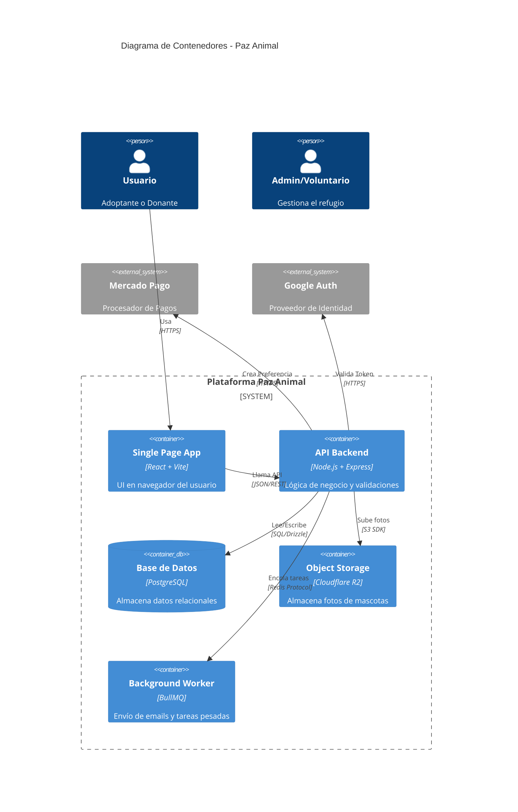

# **System Design Document (ADD)**

## **1\. Análisis de Requisitos y Escala (Back-of-the-envelope)**

Antes de diseñar, calculamos la carga esperada para no "matar moscas a cañonazos" ni quedarnos cortos.

### **1.1 Métricas de Carga Estimadas (Fase 1\)**

- **DAU (Usuarios Activos Diarios):** \~1,000 usuarios (Pico en campañas).
- **Ratio Lectura/Escritura:** 100:1 (Muchos viendo perros, pocos adoptando/editando).
- **QPS (Queries Per Second):**
  - _Reads:_ \~10 QPS (Bajo, manejable por cualquier DB SQL moderna).
  - _Writes:_ \< 1 QPS.
- **Conclusión:** Un diseño **Monolítico** con una sola instancia de Base de Datos es más que suficiente. No se requiere _Sharding_ ni Microservicios por ahora2.

### **1.2 Estimación de Almacenamiento**

- **Base de Datos (Texto):** Registros de usuarios, mascotas y transacciones.
  - _Crecimiento:_ \~1GB / año. (PostgreSQL maneja TBs sin problema).
- **Media (Imágenes/Docs):** El consumidor principal de espacio.
  - _Estrategia:_ **Offloading**. Las imágenes NO van a la DB. Se almacenan en **Cloudflare R2** (Object Storage).
  - _Estimación:_ 500 mascotas x 5 fotos x 200KB \= \~500MB de stock activo.

---

## **2\. Estrategia de Datos (Persistencia)**

### **2.1 Selección de Base de Datos Principal**

**Decisión:** **Relacional (SQL) \- PostgreSQL**3.

**Justificación:**

1. **Integridad Referencial (ACID):** Una donación _debe_ estar vinculada a un usuario real. Una adopción _debe_ bloquear a la mascota para otros. No podemos permitir "consistencia eventual" en el inventario de vidas o dinero4.
2. **Relaciones Complejas:** El modelo requiere Joins constantes (Pet \-\> Breed \-\> Vaccines).
3. **Ecosistema:** Drizzle ORM tiene soporte de primera clase para Postgres.

### **2.2 Estrategia de Escalado**

- **Fase 1 (Actual):** **Escalado Vertical**. Si la DB se pone lenta, aumentamos RAM en Railway.
- **Fase 2 (Futuro):** **Read Replicas**. Si las lecturas saturan al Master, crearemos una réplica de solo lectura para las queries del catálogo público.

---

## **3\. Caché y Optimización de Latencia**

Dado que el acceso a RAM es 100x más rápido que a disco5:

### **3.1 Niveles de Caché**

1. **CDN (Cloudflare):** Cacheo agresivo de imágenes y assets estáticos (JS/CSS) en el borde (Edge)6.
2. **Browser Cache (HTTP):** Cabeceras Cache-Control en respuestas API públicas (ej. lista de razas) para evitar hits al servidor.
3. **Application Cache (Server State):** **React Query** en el Frontend actúa como caché de corta duración, evitando refetching innecesario al navegar.

### **3.2 Estrategia (Backend)**

- **Patrón:** **Cache-Aside (Lazy Loading)**7.
  - Al pedir una mascota: Check Cache \-\> Si null, Query DB \-\> Write Cache \-\> Return.
  - _Tecnología V1:_ Caché en memoria (LRU) simple.
  - _Tecnología V2:_ Redis gestionado.

---

## **4\. Comunicación y API**

### **4.1 Estilo de Comunicación**

**Decisión:** **REST (JSON)** sobre HTTP/1.1 (o HTTP/2)8.

- Estandarizado, fácil de probar con Postman y nativo para React.

### **4.2 Procesamiento Asíncrono**

Para tareas que no deben bloquear al usuario (ej. enviar email de confirmación de adopción):

- **Mecanismo:** Message Queue simple9.
- **Implementación V1:** **BullMQ** (basado en Redis) procesando trabajos en background dentro del mismo servicio (Monolito Modular).

---

## **5\. Resiliencia y Seguridad**

### **5.1 Rate Limiting**

Protección contra ataques de fuerza bruta y DDoS capa 710.

- **Herramienta:** express-rate-limit.
- **Política:**
  - _Público:_ 100 requests / 15 min por IP.
  - _Auth (Login):_ 5 intentos fallidos / hora.

### **5.2 Idempotencia**

Vital para el módulo de Donaciones (Mercado Pago)11.

- **Regla:** Si Mercado Pago envía el webhook de "Pago Aprobado" 3 veces por error, nuestro sistema debe procesarlo solo una vez.
- **Key:** payment_id de la plataforma externa.

---

## **6\. Diagramas de Arquitectura (Mermaid)**

6.1 Diagrama de Contenedores (C4) 12

6.2 Diagrama de Secuencia: Flujo de Donación 13

```mermaid
sequenceDiagram
    autonumber
    actor User as Donante
    participant FE as Frontend
    participant API as Backend API
    participant MP as Mercado Pago
    participant DB as PostgreSQL

    User->>FE: Click "Donar $1000"
    FE->>API: POST /donations/preference
    API->>MP: Crear Preferencia de Pago
    MP-->>API: Retorna init_point (URL)
    API-->>FE: Retorna URL de pago
    FE->>User: Redirige a Mercado Pago

    User->>MP: Realiza el pago
    MP->>API: POST /webhooks/mp (Payment Approved)
    activate API
    API->>API: Validar Firma & Idempotencia
    API->>DB: INSERT transaction (Status: APPROVED)
    deactivate API
    MP-->>User: "¡Pago Exitoso!"
    User->>FE: Vuelve al sitio
```

---

7\. Resumen de Trade-offs (Compromisos) 14

| Decisión             | Beneficio (Pros)                                             | Costo/Riesgo (Cons)                                                           |
| :------------------- | :----------------------------------------------------------- | :---------------------------------------------------------------------------- |
| **Monolito Modular** | Desarrollo rápido, despliegue simple, fácil debugging.       | Si un módulo consume toda la CPU, se cae todo el sitio.                       |
| **SQL (Relacional)** | Integridad de datos garantizada (ACID). Consultas poderosas. | Escalar horizontalmente (Sharding) es difícil y costoso.                      |
| **CSR (React SPA)**  | UX fluida tipo app. Hosting de frontend muy barato (CDN).    | SEO requiere configuración extra (Helmet/Prerender). Carga inicial más lenta. |
