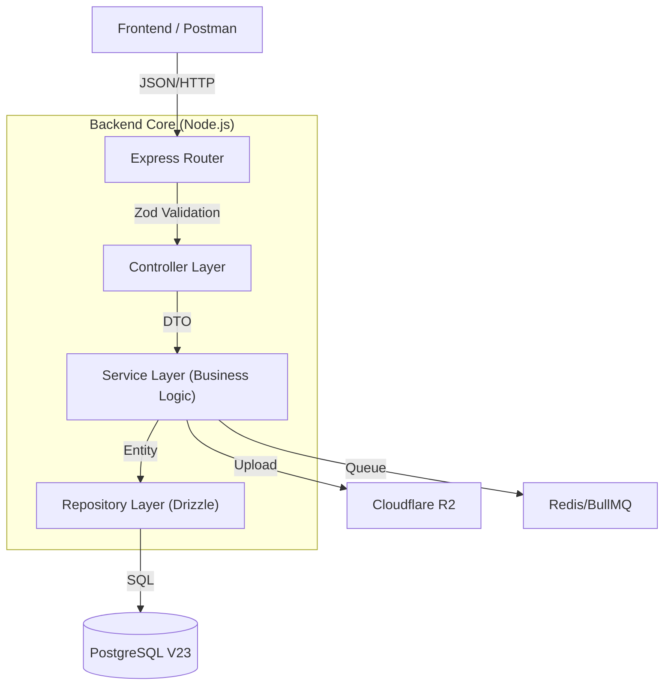

# Technical Design Document (TDD) - Backend

## 1. Introducción

### Visión General

El backend de **Paz Animal** es una API RESTful diseñada como un **Monolito Modular** construido sobre Node.js. Actúa como la fuente de verdad centralizada para la gestión de adopciones, el inventario de mascotas y el procesamiento de donaciones.

> **Nota Arquitectónica:** No es un microservicio, pero su estructura interna de módulos permite esa evolución si fuera necesaria en el futuro.

### Contexto

La fundación necesita digitalizar sus procesos manuales (actualmente en Excel/Papel). El sistema debe garantizar la **integridad de los datos** (cero pérdida de donaciones, evitar duplicidad en adopciones) y exponer una interfaz de baja latencia para el Frontend público.

### Glosario Técnico

- **DTO (Data Transfer Object):** Objeto Zod que define estrictamente qué datos entran y salen de la API.

- **V23:** Versión actual del esquema de base de datos Multi-Tenant.

- **R2:** Cloudflare R2 (Object Storage compatible con la API de S3).

- **Polimórfico:** Relación de base de datos donde una tabla (ej. `media`) puede pertenecer a múltiples entidades distintas (como `pets` o `news`).

---

## 2. Objetivos y No-Objetivos

### Objetivos del Diseño

1. **Integridad de Datos (Prioridad 1):** Uso de PostgreSQL con _constraints_ estrictas y transacciones ACID. Una adopción no puede quedar en un estado intermedio.

2. **Type-Safety Total:** Desde la base de datos (Drizzle) hasta el Controller (Zod), el flujo de datos debe estar tipado en TypeScript para evitar errores en tiempo de ejecución (`undefined is not a function`).

3. **Rendimiento:** Latencia de endpoints de lectura (`GET /pets`) < **200ms (P95)**.

### No-Objetivos (Fase Actual)

- **Microservicios:** La complejidad de orquestación supera los beneficios actuales.

- **WebSockets en tiempo real:** Las notificaciones serán asíncronas (Email) o mediante _Polling_ en esta versión.

---

## 3. Arquitectura del Sistema

### Diagrama de Capas (Container Level)



### Patrones Arquitectónicos

- **Estilo:** Monolito Modular (_Modular Monolith_).

- **Diseño:** [Arquitectura de 3 Capas](https://martinfowler.com/eaaCatalog/serviceLayer.html) (Controller - Service - Repository).

- _Ventaja:_ Desacopla la lógica de negocio del framework web (Express) y de la base de datos.

### Tecnologías Clave

- **Runtime:** Node.js 20+ (LTS).

- **Framework:** Express 4 (Estándar de industria, fácil de migrar).

- **ORM:** **Drizzle ORM**. Elegido por sobre Prisma por su bajo _overhead_ y control SQL directo.

- **Validación:** Zod.

---

## 4. Diseño Detallado

### Modelo de Datos (Database Design)

Utilizamos un esquema **Multi-Schema** en Postgres para organizar lógicamente las tablas:

- `auth`: `users`, `roles`, `permissions`, `sessions`.

- `public`: `pets`, `adoptions`, `donations`, `media`.

> **Migraciones:** Gestionadas vía `drizzle-kit migrate`. Nunca se modifica la DB manualmente.

### Diseño de API (Estándar JSend)

Todas las respuestas siguen un formato JSON estricto para predecibilidad en el cliente:

**Respuesta de Éxito:**

```json
{
  "status": "success",
  "data": {
    "pet": { "id": 1, "name": "Firulais" }
  }
}
```

**Respuesta de Error:**

```json
{
  "status": "error",
  "message": "La mascota ya ha sido adoptada.",
  "code": "PET_ALREADY_ADOPTED"
}
```

### Lógica de Negocio: Flujo de Donación

1. **Frontend:** Envía intención de donación (`amount`, `email`).

2. **Controller:** Valida el input con Zod.

3. **Service:**

  - Llama a API Mercado Pago -> `createPreference`.

  - Registra transacción en DB con estado `PENDING`.

4. **Webhook Controller:** Recibe notificación de MP y valida la firma de seguridad.

5. **Service:** Actualiza transacción a `APPROVED` y dispara email de agradecimiento (vía BullMQ).

### Autenticación y Seguridad

- **AuthN:** JWT (Access Token 15min + Refresh Token 7 días).

- **AuthZ:** Middleware RBAC (Role-Based Access Control).

```typescript
// Ejemplo de uso en ruta
router.post("/pets", requireRole("ADMIN"), createPet);
```

---

## 5. Consideraciones de Implementación

### Manejo de Errores

- Uso de una clase `AppError` personalizada que extiende de `Error`.

- **Global Exception Filter:** Un middleware al final de `app.js` captura cualquier error no manejado, lo registra en logs JSON y devuelve un `500 Internal Server Error` genérico al usuario (evitando exponer _Stack Traces_).

### Observabilidad

- **Logging:** Librería `pino`. Formato JSON estructurado.

- Niveles: `info` (producción), `debug` (desarrollo).

- **Health Check:** Endpoint `/health` para monitoreo de uptime (útil para Railway/K8s).

### Estrategia de Pruebas

- **Unitarias:** `Vitest`. Foco en Services y utilidades puras.

- **Integración:** `Supertest`. Foco en Controllers. Se levanta una DB de prueba en Docker, se ejecuta el endpoint real y se verifica la persistencia del dato.

---

## 6. Riesgos y Mitigación

| Riesgo                      | Impacto                                                               | Mitigación                                                                                                 |
| --------------------------- | --------------------------------------------------------------------- | ---------------------------------------------------------------------------------------------------------- |
| **Cuello de botella en DB** | La DB se satura por exceso de lecturas públicas.                      | Implementar caché en memoria (**Redis**) para endpoints críticos como `GET /pets`.                         |
| **Fallo en Webhook MP**     | Se cobra al usuario pero no se registra la donación en el sistema.    | El Webhook debe ser idempotente y responder `200 OK` **solo tras** guardar en DB. Logs críticos en Sentry. |
| **Complejidad de Tipos**    | Drizzle + Zod + TS puede volverse verborrágico y difícil de mantener. | Usar `drizzle-zod` para generar esquemas de validación automáticamente desde la definición de la DB.       |

---

## 7. Plan de Implementación

- **Semana 1:** Setup de Monorepo, Docker, configuración de Drizzle y Módulo de Auth.

- **Semana 2:** Módulo de Mascotas (CRUD completo) e integración con R2 (Imágenes).

- **Semana 3:** Módulo de Adopciones y Módulo de Donaciones (Integración Mercado Pago).

- **Semana 4:** Testing de integración, QA y despliegue a entorno de Staging.