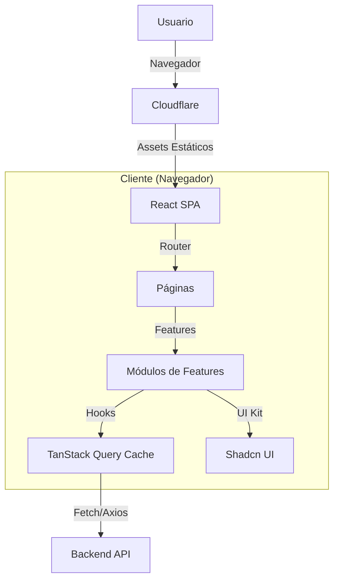

# Technical Design Document (TDD) - Frontend

## 1. Introducción

### Visión General

El Frontend de **Paz Animal** es una _Single Page Application_ (SPA) moderna, diseñada para ofrecer una experiencia de usuario fluida, reactiva y emocionalmente conectada. Su objetivo principal es reducir la fricción entre la intención de ayudar (adoptar/donar) y la acción concreta.

- **Compatibilidad:** Funciona perfectamente tanto en móviles (tráfico principal) como en escritorio.

### Audiencia

Desarrolladores Frontend, Diseñadores UI/UX y QA Testers.

### Antecedentes y Contexto

La fundación requiere una presencia digital que supere las limitaciones de las redes sociales (búsqueda difícil, información desactualizada). La solución debe permitir filtrar mascotas y gestionar donaciones con confianza.

### Glosario

- **SPA:** Single Page Application (No recarga la página al navegar).
- **FSD (Feature-Sliced Design):** Metodología de arquitectura de carpetas utilizada (adaptada).
- **Shadcn/UI:** Colección de componentes base accesibles y estilizados.
- **Server State:** Datos que pertenecen al servidor (ej. lista de mascotas) y se sincronizan en el cliente.

---

## 2. Objetivos y No-Objetivos

### Objetivos del Diseño

- **Rendimiento:** _Core Web Vitals_ en verde. LCP < 2.5s.
- **Accesibilidad:** Cumplimiento estricto de **WCAG 2.1 AA** (Navegación por teclado, lectores de pantalla).
- **Mantenibilidad:** Separación clara entre componentes "tontos" (UI pura) y componentes "listos" (Lógica).
- **SEO:** Indexación correcta de fichas de mascotas mediante metadatos dinámicos (`react-helmet-async`).

### No-Objetivos

- **Server Side Rendering (SSR) Completo:** Se utiliza **CSR** (Client-Side Rendering) por simplicidad y costo. (Next.js se descartó para esta fase).
- **Micro-Frontends:** La aplicación es un monolito modular, no una federación.

---

## 3. Arquitectura del Sistema

### Diagrama de Alto Nivel



### Patrones Arquitectónicos

- **Componentización:** _Atomic Design_ pragmático.
- _Atoms/Molecules:_ `src/components/ui` (Botones, Inputs).
- _Organisms/Templates:_ `src/features/*` (Formularios complejos, Cards de mascotas).

- **Feature-First:** El código se agrupa por funcionalidad (`features/adoptions`), no por tipo técnico.

### Tecnologías Clave

- **Core:** React 18+ con TypeScript.
- **Build Tool:** Vite (Rápido, HMR instantáneo).
- **Estilos:** Tailwind CSS (Utility-first) + `clsx` / `tailwind-merge`.
- **Componentes:** Shadcn/UI (Radix Primitives).
- **Estado Servidor:** TanStack Query (v5).
- **Formularios:** React Hook Form + Zod Resolver.

---

## 4. Diseño Detallado

### Gestión de Estado

Evitamos el uso de stores globales complejos (Redux) a menos que sea estrictamente necesario.

1. **Server State (90%):** Gestionado por **TanStack Query**. Cachea respuestas de API, maneja _loading/error states_ y revalidación automática.
2. **Form State:** Gestionado por **React Hook Form**. Efímero y local.
3. **UI State Global:** Gestionado por **Context API** (Solo para: Tema Oscuro/Claro, Estado de Autenticación, Toast Notifications).

### Estructura de Componentes y Directorios

```text
src/
├── components/ui/       # Botones, Dialogs (Genéricos)
├── features/
│   ├── auth/            # Login, Registro
│   ├── pets/            # Catálogo, Filtros, Card
│   │   ├── components/  # PetCard.tsx, PetFilters.tsx
│   │   ├── hooks/       # usePets.ts (Query)
│   │   └── types/       # Interfaces locales
│   └── donations/       # Pasarela de pago
├── layouts/             # MainLayout (Header+Footer), AuthLayout
├── pages/               # Rutas que instancian features
└── lib/                 # Configuración (axios, queryClient)

```

### Interacción con API y Datos

- **Cliente HTTP:** Instancia de `axios` o `ky` configurada en `src/lib/api-client.ts`.
- **Interceptores:**
- _Request:_ Inyecta el Token JWT en el header `Authorization`.
- _Response:_ Detecta `401 Unauthorized` para redirigir al login o refrescar token.

- **Tipado:** Los tipos de respuesta se comparten desde el backend (`packages/shared-types`) o se infieren con Zod.

### Enrutamiento

- **Librería:** `react-router-dom` v6.
- **Estrategia:**
- _Rutas Públicas:_ `/`, `/adoptar`, `/donar`.
- _Rutas Protegidas:_ `/admin/*`, `/mi-perfil` (Usando un componente `<ProtectedRoute>`).
- _Lazy Loading:_ Las rutas pesadas (Admin) se cargan bajo demanda (`React.lazy`).

### Manejo de Errores

- **Visual:** Componentes `ErrorFallback` en las rutas principales.
- **Notificaciones:** Uso de **Sonner** (Toasts) para feedback de errores de API (ej. "Error al guardar cambios").

---

## 5. Consideraciones de Implementación

### Accesibilidad (a11y)

- Todos los componentes interactivos deben tener estados `:focus-visible`.
- Uso de elementos semánticos (`<main>`, `<nav>`, `<article>`).
- Validación automática con plugin `eslint-plugin-jsx-a11y`.

### Estrategia de Pruebas

- **Unitarias (Vitest):** Para utilidades (`formatCurrency`) y hooks complejos.
- **Componentes (React Testing Library):** Para asegurar que los botones disparan eventos y los inputs aceptan texto.
- **E2E (Playwright - Fase 2):** Para flujos críticos (Donación completa, Adopción).

### Seguridad Frontend

- **XSS:** React escapa variables por defecto. Usar `dangerouslySetInnerHTML` está prohibido salvo excepciones auditadas (Rich Text del CMS).
- **Datos Sensibles:** Nunca almacenar tokens en `localStorage` si es posible (preferir memoria + refresh cookie), o usar almacenamiento seguro.

---

## 6. Riesgos y Alternativas

| Riesgo          | Impacto                                        | Mitigación                                                                    |
| --------------- | ---------------------------------------------- | ----------------------------------------------------------------------------- |
| **SEO en SPA**  | Google podría no indexar bien el contenido JS. | Usar `react-helmet-async` para meta-tags y generar `sitemap.xml` en el build. |
| **Bundle Size** | Carga inicial lenta en móviles 3G.             | _Code Splitting_ agresivo por ruta y compresión Brotli en Cloudflare.         |

### Diseños Alternativos Considerados

- **Next.js (SSR):** Se descartó porque requiere infraestructura de servidor Node.js (más caro en Railway) y añade complejidad de hidratación. La SPA estática en CDN es más económica y suficiente para la Fase 1.

---

## 7. Plan de Implementación

1. **Setup:** Configurar Vite, Tailwind, ESLint, Husky.
2. **UI Kit:** Implementar sistema de diseño base (Shadcn) y temas.
3. **Core Features:** Rutas, Layouts, Autenticación.
4. **Negocio:** Módulos de Mascotas y Adopciones.
5. **Polishing:** Accesibilidad, SEO y optimización de carga.
